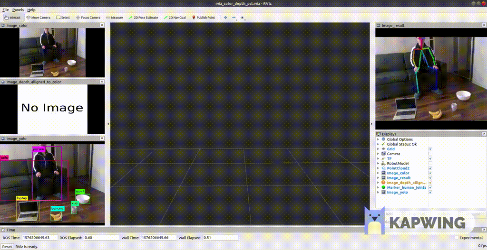

ros_3d_pointing_detection
==================================
Detect which object a person's right arm is pointing to.
  


**Contents:**
- [1. Introduction](#1-introduction)
- [2. Installation](#2-installation)
  * [2.1. Visualize 3D human skeletons in ROS Rviz (Another of my project)](#21-visualize-3d-human-skeletons-in-ros-rviz)
  * [2.2. Human pose detector Openpose](#22-human-pose-detector-openpose)
  * [2.3. Object detector YOLO](#23-object-detector-yolo)
  * [2.4. Rgbd image publisher (Another of my project)](#24-rgbd-image-publisher)
- [3. Usage](#3-usage)


# 1. Introduction

The workflow of this project is:
1. Detect **2D human joints** from *color image* by **Openpose**.
2. Compute **3D human joints** from 2D joints and *depth image*. 
6. Detect target objects by **YOLO**.
3. If the right arm is fully stretched, then the person is doing a "pointing" action. (The arm is stretched if the angle between the upper arm and forearm is smaller than the threshold.)
4. The pointing direction(ray) is defined as the vector from shoulder to wrist.
5. The 3D pixel that is in front of the wrist and is very close to the pointing ray is where the person is pointing to. 
6. Backproject this 3D pixel to 2D image. If this 2D pixel is in one of the objects' bounding boxes, then we know the person is pointing to that object! Done!

You may download the video demo [here](https://github.com/felixchenfy/ros_3d_pointing_detection/blob/master/doc/video_demo/demo.mp4) or watch the youtube [here](https://youtu.be/fKQgbHPsr0g). The annotations of the demo are illustrated below:


1. If the person is doing a "pointing" action, A red ray is drawn onto 3D image (the point cloud in the middle) and 2D image (the image on the upper right corner).
2. The intersection of the pointing ray and the point cloud is marked with a red dot in 3D/2D image.
3. If the person is pointing to an object, a red box is drawn onto the 2D image around that object.


# 2. Installation

**Environment:**    
Ubuntu 18.04, ROS melodic, python2.

First, install some common python libraries:
```
pip2 install --user open3d
```

## 2.1. Visualize 3D human skeletons in ROS Rviz
The package is here https://github.com/felixchenfy/ros_openpose_rgbd. 
It uses Openpose and depth image to visualize the 3D humans joints in rviz. Please download it:
```
cd ~/catkin_ws/src # You catkin workspace. The dir name "catkin_ws" doesn't matter.
git clone https://github.com/felixchenfy/ros_openpose_rgbd
```

Please read its README, and make sure you can run its example code:
```
rosrun ros_openpose_rgbd detect_and_draw_joints.py
roslaunch ros_openpose_rgbd run_rviz.launch
```

## 2.2. Human pose detector Openpose

I'm using the official CMU's [Openpose](https://github.com/CMU-Perceptual-Computing-Lab/openpose). You should have installed it when testing [ros_openpose_rgbd](https://github.com/felixchenfy/ros_openpose_rgbd)

## 2.3. Object detector YOLO

Its github is https://github.com/leggedrobotics/darknet_ros. Please read its tutorial and install it :
```
cd catkin_ws/src
git clone --recursive git@github.com:leggedrobotics/darknet_ros.git
cd ..
catkin_make -DCMAKE_BUILD_TYPE=Release
```

I'm using its YOLOv3 model, so download the weights file:
```
cd catkin_ws/src/darknet_ros/darknet_ros/yolo_network_config/weights/
wget http://pjreddie.com/media/files/yolov3.weights
```

## 2.4. Rgbd image publisher

```
cd ~/catkin_ws/src
git clone https://github.com/felixchenfy/ros_pub_and_sub_rgbd_and_cloud
cd ros_pub_and_sub_rgbd_and_cloud
chmod a+x pub_rgbd_and_cloud.py
```

# 3. Usage

```
# Step 1. Publish data and start rviz.
roslaunch ros_3d_pointing_detection publish_test_rgbd_data.launch

# Step 2. Start object detection.
roslaunch ros_3d_pointing_detection darknet_ros.launch 

# Step 3. Start Openpose and pointing detection.
rosrun ros_3d_pointing_detection detect_and_draw_joints.py \
    --data_source rostopic \
    --detect_object true \
    --ros_topic_color camera/color/image_raw \
    --ros_topic_depth camera/aligned_depth_to_color/image_raw \
    --ros_topic_camera_info camera/color/camera_info
```

The data publish rate is set as 1 image/second. Please read [launch/publish_test_rgbd_data.launch](launch/publish_test_rgbd_data.launch), and change publish settings in [config/publish_test_rgbd_data_config.yaml](config/publish_test_rgbd_data_config.yaml).

* Run on Realsense
    If you want to read data from D435, you may replace step 1 with this command:
    ```
    roslaunch ros_3d_pointing_detection run_realsense.launch
    ```

* Speed
    this project runs pretty slow -- Not real time, only 6 frames/second on my RTX2070. If the code is rewrote in c++ instead of python, it might be able to reach 10 fps.